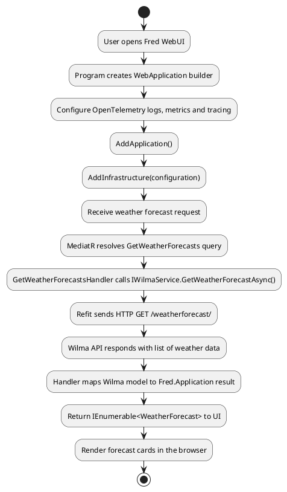

# UML Activity Diagram

```plantuml
@startuml
start
:User opens Fred WebUI;
:Program creates WebApplication builder;
:Configure OpenTelemetry logs, metrics and tracing;
:AddApplication();
:AddInfrastructure(configuration);
:Receive weather forecast request;
:MediatR resolves GetWeatherForecasts query;
:GetWeatherForecastsHandler calls IWilmaService.GetWeatherForecastAsync();
:Refit sends HTTP GET /weatherforecast/;
:Wilma API responds with list of weather data;
:Handler maps Wilma model to Fred.Application result;
:Return IEnumerable<WeatherForecast> to UI;
:Render forecast cards in the browser;
stop
@enduml
```
