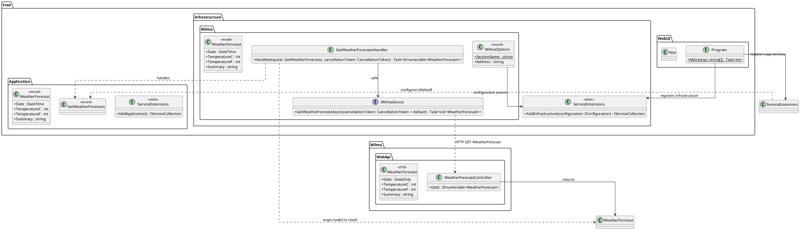

# UML Class Diagram

```plantuml
@startuml
skinparam classAttributeIconSize 0
skinparam linetype ortho

package "Fred.WebUI" {
  class Program {
    + {static} Main(args: string[]) : Task<int>
  }

  class App
}

package "Fred.Application" {
  class ServiceExtensions <<static>> {
    + AddApplication() : IServiceCollection
  }

  class GetWeatherForecasts <<record>> {
  }

  class WeatherForecast <<record>> {
    + Date : DateTime
    + TemperatureC : int
    + TemperatureF : int
    + Summary : string
  }
}

package "Fred.Infrastructure" {
  class ServiceExtensions <<static>> {
    + AddInfrastructure(configuration: IConfiguration) : IServiceCollection
  }

  package "Wilma" {
    class WilmaOptions <<record>> {
      + {static} SectionName : string
      + Address : string
    }

    interface IWilmaService {
      + GetWeatherForecastAsync(cancellationToken: CancellationToken = default) : Task<List<WeatherForecast>>
    }

    class GetWeatherForecastsHandler {
      + Handle(request: GetWeatherForecasts, cancellationToken: CancellationToken) : Task<IEnumerable<WeatherForecast>>
    }

    class WeatherForecast <<model>> {
      + Date : DateTime
      + TemperatureC : int
      + TemperatureF : int
      + Summary : string
    }
  }
}

package "Wilma.WebApi" {
  class WeatherForecastController {
    + Get() : IEnumerable<WeatherForecast>
  }

  class WeatherForecast <<DTO>> {
    + Date : DateOnly
    + TemperatureC : int
    + TemperatureF : int
    + Summary : string
  }
}

Program --> ServiceExtensions : registers app services
Program --> "Fred.Infrastructure.ServiceExtensions" : registers infrastructure
ServiceExtensions ..> GetWeatherForecasts : configures MediatR
GetWeatherForecastsHandler ..> GetWeatherForecasts : handles
GetWeatherForecastsHandler --> IWilmaService : calls
IWilmaService ..> "Wilma.WebApi.WeatherForecastController" : HTTP GET /WeatherForecast
GetWeatherForecastsHandler ..> WeatherForecast : maps model to result
WeatherForecastController --> WeatherForecast : returns
WilmaOptions --> "Fred.Infrastructure.ServiceExtensions" : configuration source
@enduml
```
