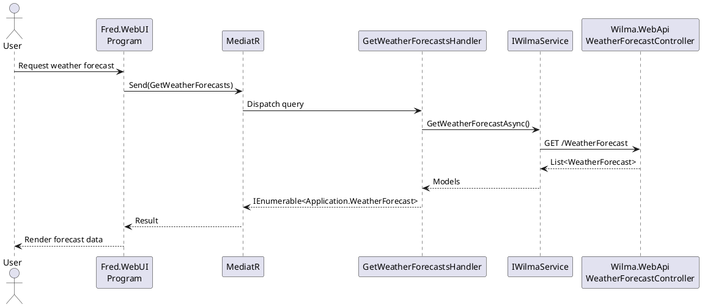

# UML Communication Diagram

```plantuml
@startuml
actor User
participant "Fred.WebUI\nProgram" as FredProgram
participant "MediatR" as Mediator
participant "GetWeatherForecastsHandler" as Handler
participant "IWilmaService" as WilmaClient
participant "Wilma.WebApi\nWeatherForecastController" as WilmaController

User -> FredProgram : Request weather forecast
FredProgram -> Mediator : Send(GetWeatherForecasts)
Mediator -> Handler : Dispatch query
Handler -> WilmaClient : GetWeatherForecastAsync()
WilmaClient -> WilmaController : GET /WeatherForecast
WilmaController --> WilmaClient : List<WeatherForecast>
WilmaClient --> Handler : Models
Handler --> Mediator : IEnumerable<Application.WeatherForecast>
Mediator --> FredProgram : Result
FredProgram --> User : Render forecast data
@enduml
```
