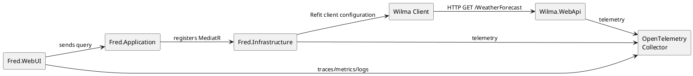

# UML Component Diagram

```plantuml
@startuml
left to right direction
skinparam componentStyle rectangle

component "Fred.WebUI" as FredUI
component "Fred.Application" as App
component "Fred.Infrastructure" as Infra
component "Wilma Client" as WilmaClient
component "Wilma.WebApi" as WilmaApi
component "OpenTelemetry\nCollector" as OTel

FredUI --> App : sends query
App --> Infra : registers MediatR
Infra --> WilmaClient : Refit client configuration
WilmaClient --> WilmaApi : HTTP GET /WeatherForecast
FredUI --> OTel : traces/metrics/logs
Infra --> OTel : telemetry
WilmaApi --> OTel : telemetry
@enduml
```
