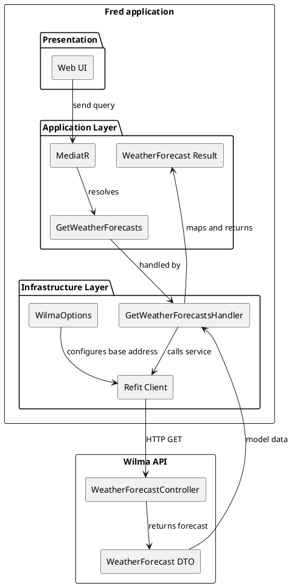

# UML Composite Diagram

```plantuml
@startuml
skinparam componentStyle rectangle

component "Fred application" as Fred {
  package "Presentation" {
    component "Web UI" as WebUI
  }

  package "Application Layer" {
    component "MediatR" as MediatR
    component "GetWeatherForecasts" as Query
    component "WeatherForecast Result" as Result
  }

  package "Infrastructure Layer" {
    component "Refit Client" as Refit
    component "WilmaOptions" as Options
    component "GetWeatherForecastsHandler" as Handler
  }
}

component "Wilma API" as WilmaAPI {
  component "WeatherForecastController" as Controller
  component "WeatherForecast DTO" as DTO
}

WebUI --> MediatR : send query
MediatR --> Query : resolves
Query --> Handler : handled by
Handler --> Refit : calls service
Refit --> Controller : HTTP GET
Controller --> DTO : returns forecast
DTO --> Handler : model data
Handler --> Result : maps and returns
Options --> Refit : configures base address
@enduml
```
