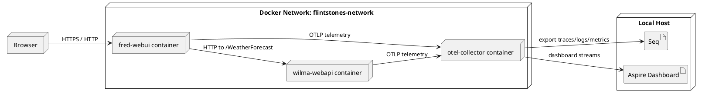

# UML Deployment Diagram

```plantuml
@startuml
left to right direction
skinparam componentStyle rectangle

node "Browser" as Browser
node "Docker Network: flintstones-network" as Network {
  node "fred-webui container" as FredContainer
  node "wilma-webapi container" as WilmaContainer
  node "otel-collector container" as OTelContainer
}
node "Local Host" as Host {
  artifact "Seq" as Seq
  artifact "Aspire Dashboard" as Aspire
}

Browser --> FredContainer : HTTPS / HTTP
FredContainer --> WilmaContainer : HTTP to /WeatherForecast
FredContainer --> OTelContainer : OTLP telemetry
WilmaContainer --> OTelContainer : OTLP telemetry
OTelContainer --> Seq : export traces/logs/metrics
OTelContainer --> Aspire : dashboard streams
@enduml
```
