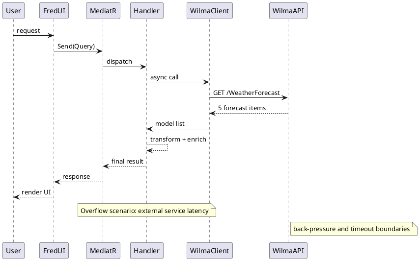

# UML Interaction Overflow Diagram

```plantuml
@startuml
participant User
participant FredUI
participant MediatR
participant Handler
participant WilmaClient
participant WilmaAPI

User -> FredUI : request
FredUI -> MediatR : Send(Query)
MediatR -> Handler : dispatch
Handler -> WilmaClient : async call
WilmaClient -> WilmaAPI : GET /WeatherForecast
WilmaAPI --> WilmaClient : 5 forecast items
WilmaClient --> Handler : model list
Handler --> Handler : transform + enrich
Handler --> MediatR : final result
MediatR --> FredUI : response
FredUI --> User : render UI

note over Handler : Overflow scenario: external service latency
note right of WilmaAPI : back-pressure and timeout boundaries
@enduml
```
