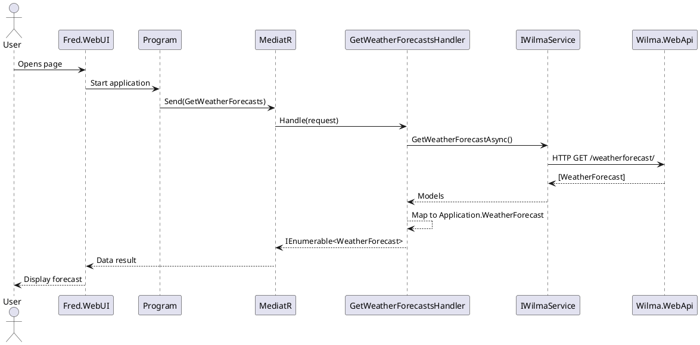

# UML Sequence Diagram

```plantuml
@startuml
actor User
participant "Fred.WebUI" as UI
participant "Program" as Program
participant "MediatR" as MediatR
participant "GetWeatherForecastsHandler" as Handler
participant "IWilmaService" as Client
participant "Wilma.WebApi" as Wilma

User -> UI : Opens page
UI -> Program : Start application
Program -> MediatR : Send(GetWeatherForecasts)
MediatR -> Handler : Handle(request)
Handler -> Client : GetWeatherForecastAsync()
Client -> Wilma : HTTP GET /weatherforecast/
Wilma --> Client : [WeatherForecast]
Client --> Handler : Models
Handler --> Handler : Map to Application.WeatherForecast
Handler --> MediatR : IEnumerable<WeatherForecast>
MediatR --> UI : Data result
UI --> User : Display forecast
@enduml
```
