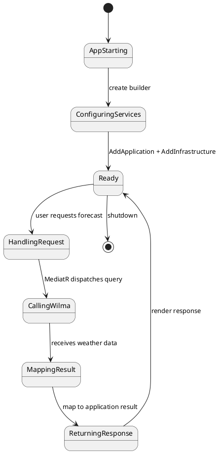

# UML State Diagram

```plantuml
@startuml
[*] --> AppStarting
AppStarting --> ConfiguringServices : create builder
ConfiguringServices --> Ready : AddApplication + AddInfrastructure
Ready --> HandlingRequest : user requests forecast
HandlingRequest --> CallingWilma : MediatR dispatches query
CallingWilma --> MappingResult : receives weather data
MappingResult --> ReturningResponse : map to application result
ReturningResponse --> Ready : render response
Ready --> [*] : shutdown
@enduml
```
