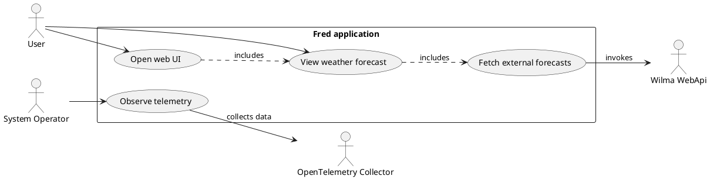

# UML Use Case Diagram

```plantuml
@startuml
left to right direction
actor User
actor "System Operator" as Operator

rectangle "Fred application" {
  usecase "View weather forecast" as ViewForecast
  usecase "Open web UI" as OpenUI
  usecase "Fetch external forecasts" as FetchForecast
  usecase "Observe telemetry" as ObserveTelemetry
}

User --> OpenUI
User --> ViewForecast
Operator --> ObserveTelemetry
OpenUI ..> ViewForecast : includes
ViewForecast ..> FetchForecast : includes
FetchForecast --> "Wilma WebApi" : invokes
ObserveTelemetry --> "OpenTelemetry Collector" : collects data
@enduml
```
